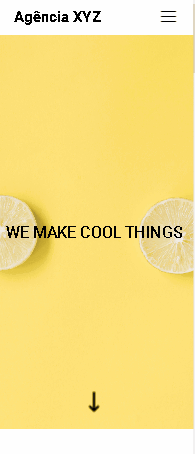

# Landing Page XYZ
Minha primeira landing page, embora tenha sido um projeto de um curso e não um projeto inteiramente meu, permitiu-me aprender muitos recursos novos.😎
## Versão Desktop:

[]

## Versão Mobile:

[]

### Novos desafios:
Este projeto me fez enfrentar alguns desafios que eu ainda não tinha enfrentado, tais como criar o menu hamburguer para dispositivos móveis, utilizar o Font Awesome para adicionar ícones de redes sociais e empregar o display grid dentro de uma página já construída com display grid. 😊

#### Tecnologias utilizadas
- HTML
- CSS
